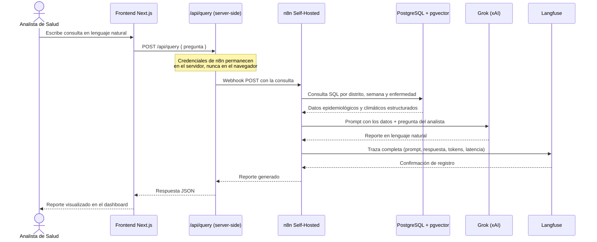
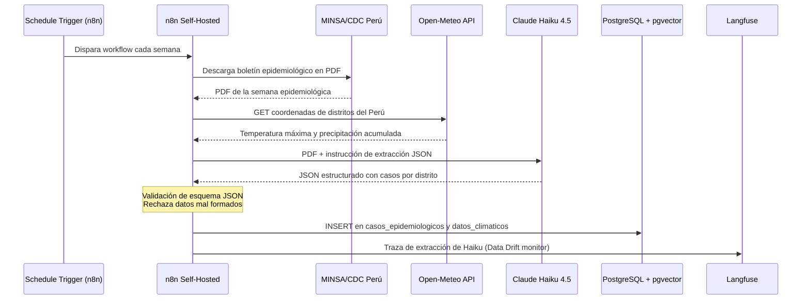

# HealthRadar

Sistema de vigilancia epidemiológica automatizada para el Perú, desarrollado por la Célula 5.

Integra datos de enfermedades de notificación obligatoria del MINSA/CDC Perú con variables climáticas de Open-Meteo, y permite que analistas de salud pública consulten el historial en lenguaje natural.

---

## Arquitectura del Sistema

El sistema sigue un flujo de datos estricto donde cada capa tiene una responsabilidad única:

```
Analista de Salud
      │
      ▼
Frontend (Next.js)          ← única interfaz pública, puerto 3000
      │  /api/query (server-side)
      ▼
n8n Self-Hosted             ← orquestador único de toda la lógica
      │
      ├── Workflow de Ingesta (semanal, automático)
      │       ├── Descarga PDF boletín MINSA/CDC Perú
      │       ├── Claude Haiku 4.5 → extracción JSON estructurado
      │       ├── Validación de esquema JSON
      │       └── Inserción en PostgreSQL
      │
      └── Workflow de Consulta NLQ (por webhook)
              ├── Consulta PostgreSQL (datos + vectores)
              ├── Grok (xAI) → reporte en lenguaje natural
              ├── Traza enviada a Langfuse
              └── Respuesta al Frontend

PostgreSQL 16 + pgvector    ← base de datos única (tabular + vectorial)
Langfuse Self-Hosted        ← observabilidad pasiva de todos los LLMs
```

**Regla crítica de arquitectura:** el Frontend no accede directamente a la base de datos ni a ninguna API de IA. Todo pasa por n8n.

---

## Flujo del Dato — Consulta en Lenguaje Natural (NLQ)

El siguiente diagrama muestra el recorrido completo de una consulta desde que el analista la escribe hasta que recibe el reporte:



---

## Flujo del Dato — Ingesta Semanal Automatizada



---

## Decisiones de Arquitectura (ADRs)

Cada decisión técnica relevante del proyecto está documentada en `infrastructure/ADRs/`.

| ADR | Título | Estado |
|-----|--------|--------|
| [ADR-001](infrastructure/ADRs/ADR-001-n8n-self-hosted-orquestacion.md) | n8n Self-Hosted como capa de orquestación | Vigente |
| [ADR-002](infrastructure/ADRs/ADR-002-postgresql-pgvector-base-de-datos.md) | PostgreSQL con pgvector como única base de datos | Vigente |
| [ADR-003](infrastructure/ADRs/ADR-003-division-llms-por-momento-operacion.md) | División de LLMs por momento de operación | Vigente |
| [ADR-004](infrastructure/ADRs/ADR-004-nextjs-frontend-capa-seguridad.md) | Next.js con rutas de API como capa de seguridad | Vigente |
| [ADR-005](infrastructure/ADRs/ADR-005-langfuse-observabilidad-llms.md) | Langfuse como plataforma de observabilidad | Vigente |
| [ADR-006](infrastructure/ADRs/ADR-006-minsa-cdc-fuente-datos-epidemiologicos.md) | MINSA/CDC Perú como fuente de datos epidemiológicos | Vigente |
| [ADR-007](infrastructure/ADRs/ADR-007-open-meteo-fuente-datos-climaticos.md) | Open-Meteo como fuente de datos climáticos | Vigente |
| [ADR-008](infrastructure/ADRs/ADR-008-docker-compose.md) | Docker Compose como estrategia de despliegue | Vigente |
| [ADR-009](infrastructure/ADRs/ADR-009-oci-always-free-hosting.md) | OCI Always Free como proveedor de hosting | Vigente |

---

## Levantar el Sistema Localmente

**Requisito previo:** tener Docker Desktop instalado y activo.

```bash
# 1. Clonar el repositorio
git clone https://github.com/Roberto-Bautista/Celula5_HealthRadar.git
cd Celula5_HealthRadar

# 2. Configurar variables de entorno
cp infrastructure/.env.example infrastructure/.env
# Editar infrastructure/.env con las credenciales propias

# 3. Levantar los 4 servicios
cd infrastructure
docker compose up -d

# 4. Verificar que todos los contenedores están activos
docker ps
```

El sistema queda disponible en `http://localhost:3000` (Frontend).

---

## Estructura del Repositorio

```
/
├── .github/
│   ├── PULL_REQUEST_TEMPLATE.md
│   └── workflows/               # Pipelines de CI/CD
├── infrastructure/
│   ├── ADRs/                    # Decisiones de arquitectura
│   ├── scripts/                 # Scripts de verificación y PoC
│   ├── docker-compose.yml       # Orquestación de contenedores
│   └── .env.example             # Plantilla de variables de entorno
├── src/
│   ├── frontend/                # Aplicación Next.js
│   ├── n8n-workflows/           # Workflows de n8n (JSON versionados)
│   ├── database/
│   │   ├── migrations/          # Migraciones SQL numeradas
│   │   └── test_poc_adr002.sql  # Script de prueba pgvector
│   └── ia-ops/                  # Prompts versionados y QA de modelos
└── README.md
```

---

## Seguridad

- Las credenciales se gestionan exclusivamente mediante variables de entorno (`.env`).
- El archivo `.env` está excluido del control de versiones por el `.gitignore`.
- La plantilla [`infrastructure/.env.example`](infrastructure/.env.example) documenta las variables requeridas sin valores reales.
- Los tokens de n8n nunca se exponen al navegador (ver [ADR-004](infrastructure/ADRs/ADR-004-nextjs-frontend-capa-seguridad.md)).